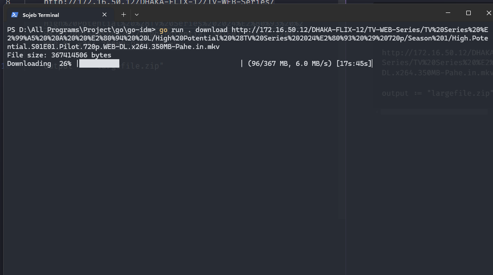

# Description

Fast Internet download manager created using Go. Supports Windows, Linux, and macOS.

It downloads faster by downloading chunks parallelly

# Screenshots



# Build

```bash
./build.sh
```

# Usage

```bash
sdm download "https://example.com/file.zip" --output myfolder --worker 8 --cookie "sessionid=12345; user=sojeb"
```

# Supported commands

- `download` - for downloading file
  - (optional) support `--output` flag that used to specify the output location
  - (optional) `--worker` flag to override the worker count
  - (optional) `--cookie` flag to set cookies
  - (optional) `--header` flag to set custom headers (can be multiple)
  - (optional) `--user-agent` flag to set custom user agent

# Features:

- Multi-threaded downloads (auto-adjusted based on file size or customizable with `-worker`)
- Supports HTTP Range requests for faster, resumable downloads
- Fallback to single-thread mode if server doesn’t support partial content
- Real-time progress bar with byte tracking
- Automatic retry mechanism on failure
